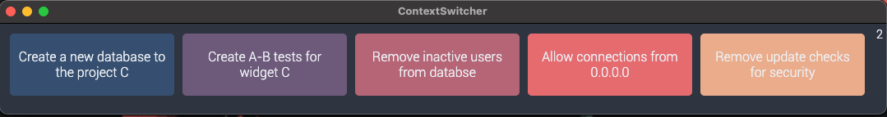

ContextSwitcher
===

An [Electron](https://www.electronjs.org/) app that keep track of the tasks you are doing with a simple interface.

Click on the item or just hit Enter to add new tasks. Click to make the timer active. Right click to remove it. Simple!

**The numbers represent the minutes spent on that thask:**



## Try it youself
This app runs with nodejs and build to any OS using [Electron](https://www.electronjs.org/).

To build a version of the app to your OS you need to download the code and run it with nodejs:

Download the code:

```bash
git clone git@github.com:mariogarridopt/ContextSwitcher.git
cd ContextSwitcher
```

Run the script with nodejs:

```bash
npm install && npm run make
```

If you just want to make it run so you can work on the code you can always make it run without building with:

```bash
npm install && npm start
```

The files are organized in a way that the mas dir is responsable to make the app run inside Electron and everything that the WebPage needs to run is inside `/app`.

### Design choices
I was folowing the [Nord Theme](https://www.nordtheme.com/) color scheme, but then things got colorful when I made every card a random color.
